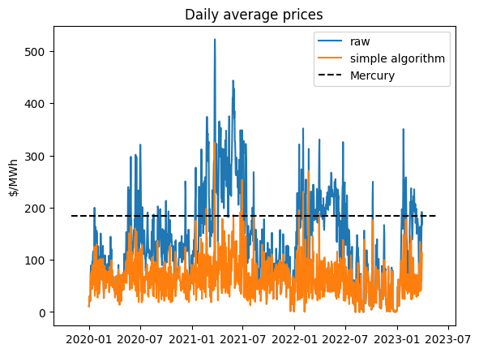

# hwc
Hot Water Cylinder Demand Response
This is a work in progress for controlling a hot water cylinder relative to real time prices. 

the file: `get_prices.py` has:

- Authorisation through OAuth
- API connection to WITS to retrieve real-time pricing

the file: `test.py` has:
 - A test to determine what a reasonable fixed maximum price would be
 

You can see from this that a surprisingly high minimum is required to ensure 3 hours of operation per day for >90% of the year.
It is not clear in this but an non-peak periods throughout the year we would effectively be allowing the cylidner to run 24/7
This is price inefficient as we could be running at $0/MWh if we had a better algorithm.

 - A test to determine what a fixed maximum price would be if it varied throughout the year
 

You can see here that using a variable maximum price is much more efficient.
In most periods a reasonable price cap of ~100 $/MWh is feasible, with periods above the best fixed rate rare.
The issue with this is that we cannot predetermine this price cap. You can see that in 2021 and 2022 prices increased in the first half of the year but this was not seen in 2020 (COVID?) or 2023 (wet?).

The best method would be to identify daily variations and target the lowest price every calendar day

This appears to work well, with good prices paid for the periods active. But the periods active per calendar day vary significantly.

A whopping 455 days have less than 6 periods active in that calendar day.

Adding a bit more complexity: 
- If price is in the cheapest 10 of the last 48, then allow
- If price is < 100 $/MWh then allow
- if last charge period (30 mins) is more than 21 hours ago or there are less than 6 charge periods in the last 21 hours, then allow

This gives an average price of 64.166 $/MWh

And 0 days without a full charge!

